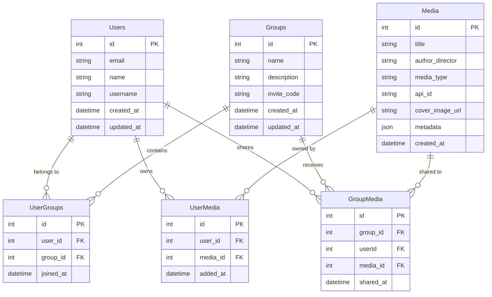

# Project Outline

**What it is:**

An online version of the *Little Free Library* concept, allowing people to share, browse, and track physical media (books, records, etc.) with in/out status and ownership tracking.

**Who it’s for:**

- Individuals with private collections who want to share selectively
- The general public browsing local *Little Free Library* boxes
- Community groups managing shared media

**Core MVP Features:**

1. User sign-up/login
2. View books/media available to them
3. Add items to public catalog or private collection
4. Create & manage groups

## MVP Features

- As a user, I can create my own collection of media, and add them to different groups I’m apart of
- As a user, I can view media from others in the groups I belong to.
- As a user, I can create groups, either public or private, and invite others to join.
- As a user, I can search/browse available media in the groups I belong to.
---
# View Checklist

- [x]  Landing
    - [x]  Login
    - [x]  Sign up
    - [x]  Forgot Password
- [x]  Dashboard / Home Page
    - [x]  Manage Media
        - [x]  List all view
        - [x]  Manage selected
        - [x]  Add Media
    - [x]  Browse Media from all groups
        - [x]  drop down filter component
        - [x]  view selected
    - [x]  Manage groups
        - [x]  List all view
        - [x]  Manage selected (only if you are the owner)
        - [x]  Create Group
---
# Entity Checklist

# Entities

- Users
    - id
    - name
    - email
    - user name
    - created at
    - updated at
- Media
    - id
    - title
    - author / director
    - media type
    - cover image url
    - meta data
    - created at
    - updated at
- Groups
    - id
    - name
    - description

---

# Relations

- UserGroups
    - id
    - userId
    - groupId
    - dateJoined
- UserMedia
    - id
    - userId
    - mediaId
    - dateAdded
- Group Media
    - id
    - userId
    - mediaId
    - groupId
    - dateAdded

---

# Stack

**Backend:**

- Node.js + Express (with serverless-express for Lambda)
- Or just plain Lambda functions if you want to go more serverless-native

**Frontend:**

- React (since you mentioned component library)
- Your existing Tailwind component library

**Database:**

- PostgreSQL on RDS (handles relationships well, JSONB for flexible API metadata)

**Hosting:**

- Backend: AWS Lambda + API Gateway
- Frontend: S3 + CloudFront (static hosting)
- DB: RDS PostgreSQL

**Storage:**

- S3 for book cover images (pulled from APIs)
- Maybe CloudFront CDN in front for faster loading

### External APIs

So: TMDB for movies, Discogs for all music formats. Both have good free tiers and solid